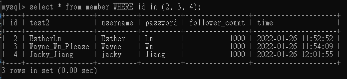
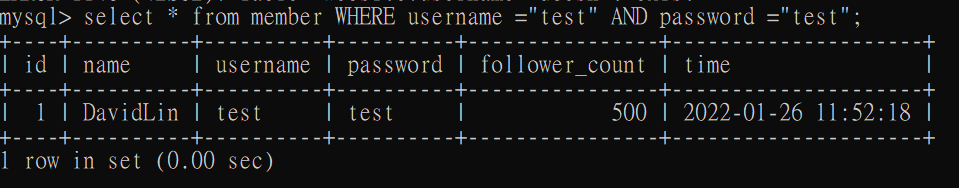

# WEeek5 MySQL : 

## 要求三：SQL CRUD : 

### 3.2 : 使用 SELECT 指令取得所有在 member 資料表中的會員資料。
cmd : SELECT * FROM member;
 

### 3.3 使用 SELECT 指令取得所有在 member 資料表中的會員資料，並按照 time 欄位，由近到遠排序。
- A.近到遠 : 
cmd : select * from member order by time asc;

- B.遠到近 : 
cmd : select * from member order by time desc;

### 3.4 使用 SELECT 指令取得 member 資料表中第 2 ~ 4 共三筆資料，並按照 time 欄位，由近到遠排序。( 並非編號 2、3、4 的資料，而是排序後的第 2 ~ 4 筆資料 )
cmd : select * from member order by time asc LIMIT 1,3;
 

#### (!)Extra(額外) : 若使用id順序的方法
cmd : select * from member WHERE id in (2, 3, 4);
 

### 3.5 使用 SELECT 指令取得欄位 username 是 test 的會員資料。
cmd : select * from member WHERE username="test";
 

### 3.6 使用 SELECT 指令取得欄位 username 是 test、且欄位 password 也是 test 的資料。
cmd : select * from member WHERE username ="test" AND password ="test";
 

### 3.7 使用 UPDATE 指令更新欄位 username 是 test 的會員資料，將資料中的 name 欄位改成 test2。
cmd : ALTER TABLE member RENAME COLUMN name TO test2;

## 要求四：SQL Aggregate Functions : 
 
## 要求五：SQL JOIN (Optional) :